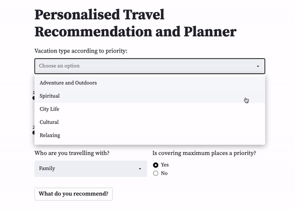
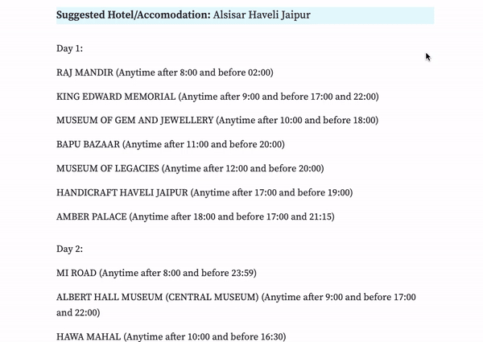

# Personalised Travel Recommender & Planner


## Aim

The widespread adoption of recommendation systems during this current technological surge has significantly benefited numerous businesses (examples include streaming platforms like Netflix, Hotstar, and Spotify, as well as e-commerce giants like Amazon) by enhancing customer satisfaction and convenience. This advancement has also contributed to making the internet more accessible. We live in an era where recommendations are so ubiquitous that we often overlook the simplicity with which these systems, designed to refine our consumer choices, have been integrated into nearly every device and platform. While we are accustomed to receiving continuous recommendations, the journey of how these systems have become embedded in our daily routines is a fascinating one, characterized by various challenges and the drive of pioneering companies. This opens up a multitude of opportunities to apply such systems to different domains, including the Travel and Tourism Industry. The proposed recommender system aims to offer users a tailored list of options for the various decisions they may encounter during their holiday. These decisions can encompass different aspects of the travel experience.

## Input



## Output



## How to run it locally

To run the project locally, ensure that you have cloned the repository and installed all the libraries from the requirements.txt file. You may create a virtual environment using pip or conda to make the process a bit more streamlined. 

Then, you can go ahead and run the main.py (from the root directory of the project) file using streamlit like so:
```
streamlit run main.py
```
